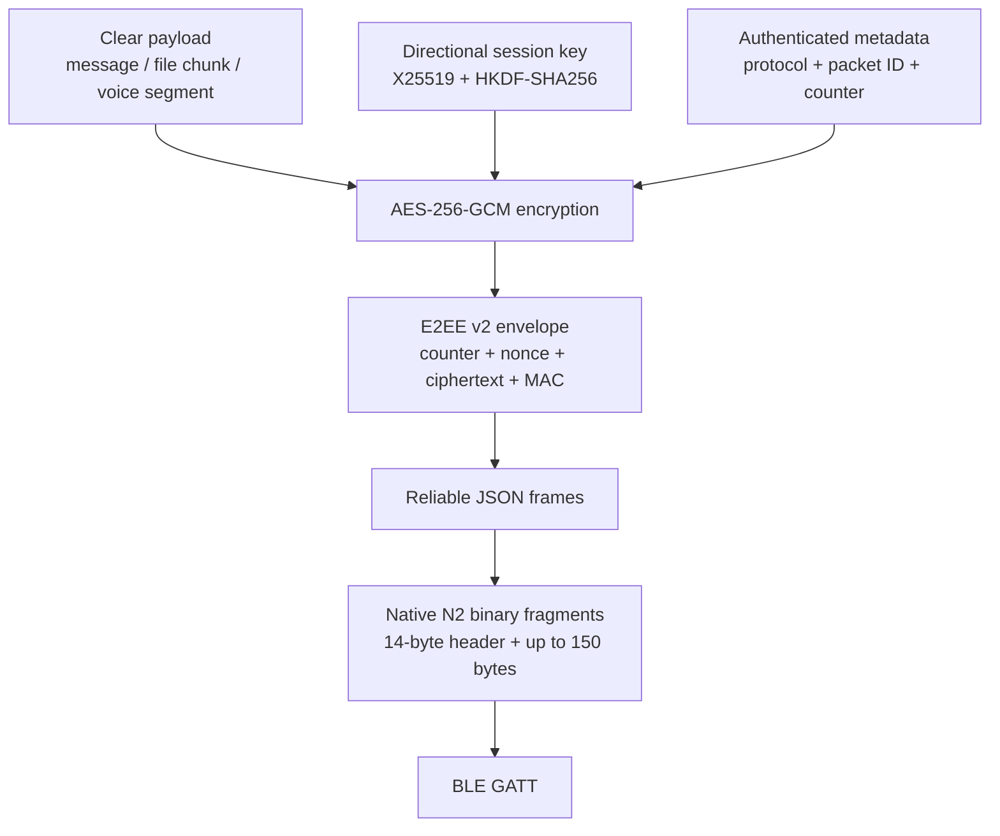
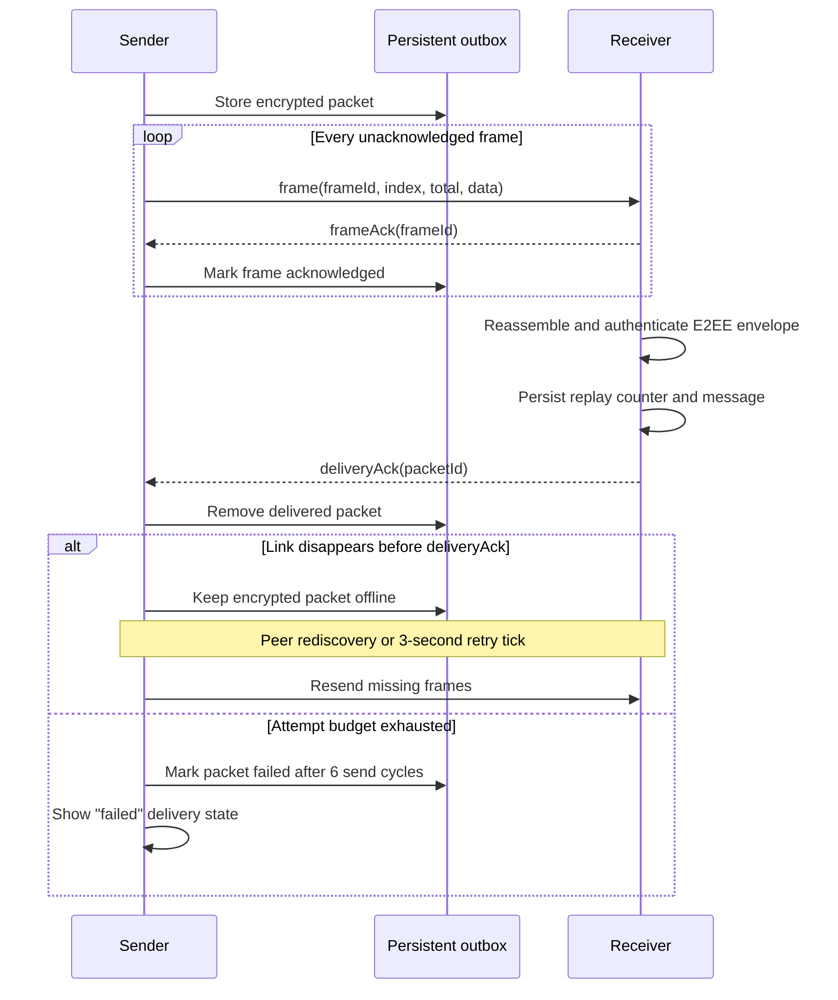
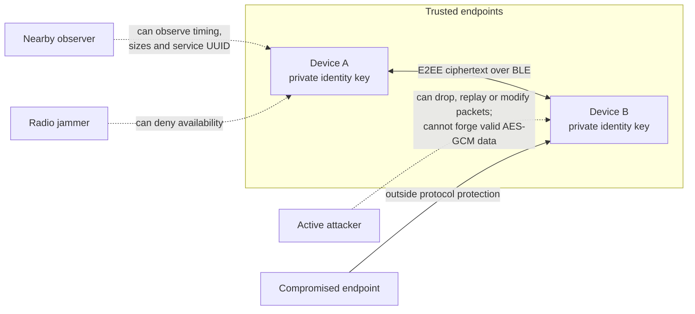

# NoNetCom

Encrypted offline Bluetooth messenger for iOS and Android.

NoNetCom lets nearby devices exchange messages, files and push-to-talk audio
without internet access or an application server. It is designed for travel,
outages, events and other places where a local radio channel is more useful
than a cloud messenger.

> Current release: `1.0.0+1` · Android application ID and iOS bundle ID:
> `com.matapps.nonetcom`

## Product Scope

- One-to-one encrypted chat with delivery states and emoji.
- Encrypted group conversations for up to six people.
- Encrypted file transfer up to 30 MB with visible progress.
- Unlimited one-to-one walkie-talkie mode over BLE.
- Local contact names, QR/safety-code verification and key-change warnings.
- Persistent offline queue, automatic retries and reconnection handling.
- Local notifications and background BLE operation.
- Export/import of trusted contacts without exporting private E2EE keys.
- Bounded diagnostic logs with an explicit user-controlled support export.

## Protocol Architecture

```mermaid
flowchart LR
    UI["Flutter UI<br/>chat, files, voice"] --> DOMAIN["Domain controllers<br/>queue and delivery state"]
    DOMAIN --> E2EE["E2EE v2<br/>X25519 + HKDF-SHA256<br/>AES-256-GCM"]
    E2EE --> RELIABLE["Reliable envelope layer<br/>128-character frames<br/>ACK, retry, offline outbox"]
    RELIABLE --> BRIDGE["Flutter platform bridge<br/>priority: control / realtime / normal / bulk"]
    BRIDGE --> NATIVE["Native BLE transport v2<br/>per-peer queues + backpressure"]
    NATIVE --> GATT["GATT link<br/>MTU negotiation<br/>N2 binary fragments"]
    GATT --> PEER["Nearby NoNetCom peer"]
```



Flutter owns message semantics, encryption, delivery acknowledgements and the
persistent outbox. Android and iOS own connection lifecycle, GATT ordering,
MTU-aware fragmentation and radio backpressure. Keeping those responsibilities
separate makes transport loss recoverable without giving native code access to
cleartext messages.

### Encrypted Packet



The receiver authenticates the envelope before processing the plaintext. A
persistent rolling window of 512 counters prevents authenticated packets from
being processed twice. Full wire details are in [PROTOCOL.md](PROTOCOL.md).

## ACK And Retry Flow



Frame ACKs limit retransmission inside one envelope. The final delivery ACK is
sent only after successful reassembly, E2EE authentication and application
processing. Duplicate authenticated packets are acknowledged again but not
shown twice.

## Threat Model



NoNetCom protects message and file contents in transit and detects ciphertext,
packet-ID and counter modification. It does not hide radio presence, packet
timing or transfer size, and it cannot protect an unlocked or compromised
endpoint. The software has not received an independent cryptographic audit.
Assumptions and exclusions are documented in
[THREAT_MODEL.md](THREAT_MODEL.md).

## Performance Results

The table intentionally contains only reproducible physical-device results.
An emulator is suitable for Dart tests, but not for BLE throughput,
reconnection latency or energy measurements.

| Metric | Android ↔ Android | Android ↔ iOS | iOS ↔ iOS | Method |
| --- | ---: | ---: | ---: | --- |
| Effective 1 MB file throughput | Pending physical-device run | Pending physical-device run | Pending physical-device run | Median KB/s from 10 successful transfers |
| Reconnection to first delivery | Pending physical-device run | Pending physical-device run | Pending physical-device run | Median ms from radio return to `deliveryAck` |
| 30-minute idle battery cost | Pending physical-device run | Pending physical-device run | Pending physical-device run | Battery percentage points and platform energy report |
| 10-minute sustained transfer cost | Pending physical-device run | Pending physical-device run | Pending physical-device run | Battery percentage points and platform energy report |

This is a measurement gate, not a marketing placeholder: results are published
only with device models, OS versions, distance, sample count and raw values.
The full procedure and result template are in
[BENCHMARKS.md](BENCHMARKS.md).

## Engineering Notes

- Native transport queues are isolated per peer and permit one acknowledged
  GATT write at a time.
- Control ACKs preempt live voice, chat and bulk file traffic.
- Android uses a cached Flutter engine and a `connectedDevice` foreground
  service while Bluetooth is active.
- iOS uses Core Bluetooth state restoration for central and peripheral roles.
- E2EE keys are directional; message counters are monotonic and persistent.
- The app never requires a delivery server, account service or cloud database.
- Regression tests cover E2EE context binding, replay counters, shuffled BLE
  frames, duplicate frames, persistent outbox recovery and diagnostic privacy.

## Documentation

- [Polska dokumentacja projektu](docs/README_PL.md)
- [Przewodnik użytkownika](docs/USER_GUIDE_PL.md)
- [Development guide](docs/DEVELOPMENT_PL.md)
- [Dane i bezpieczeństwo](docs/SECURITY_AND_DATA_PL.md)
- [Troubleshooting](docs/TROUBLESHOOTING_PL.md)
- [Protocol specification](PROTOCOL.md)
- [Threat model](THREAT_MODEL.md)
- [Architecture](ARCHITECTURE.md)
- [Physical device QA matrix](QA_DEVICE_MATRIX.md)
- [Benchmark methodology](BENCHMARKS.md)
- [Release checklist](RELEASE.md)
- [Changelog](CHANGELOG.md)

## Local Verification

```sh
dart format lib test
flutter analyze
flutter test
flutter build apk --debug
flutter build ios --debug --no-codesign
plutil -lint ios/Runner/Info.plist
```

Android release signing uses `android/key.properties`. Copy
`android/key.properties.example`, fill in local secrets and keep the real file
out of version control.
