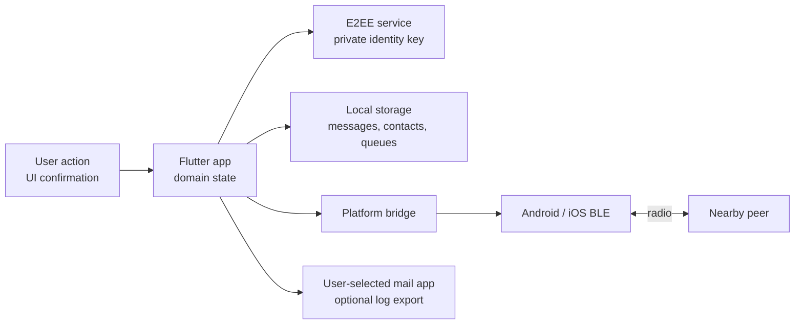

# NoNetCom Threat Model

## Security Goal

NoNetCom is designed to keep message, file and voice payload contents private
between explicitly paired nearby devices, without relying on an internet
service, account provider or delivery server.

It is not designed to make Bluetooth activity invisible, guarantee delivery
under radio interference or protect a phone that is already compromised.

## Assets

- Private X25519 identity key of the local installation.
- Public identity keys and trust state of contacts.
- Cleartext message, file and voice payloads before encryption and after
  decryption.
- Persistent transport outbox containing encrypted payloads.
- Diagnostic logs and exported support reports.
- Contact names, group membership and delivery metadata stored locally.

## Trust Boundaries

The Flutter domain layer owns plaintext handling. Native BLE layers should only
see encrypted reliable frames and control messages. Optional support e-mail
export crosses a user-controlled boundary and must never be automatic.

## Attacker Model

| Attacker | Capabilities | Expected result |
| --- | --- | --- |
| Nearby passive observer | Sniffs Bluetooth timing, service UUIDs, payload sizes and public discovery data | Cannot read encrypted payload contents |
| Nearby active attacker | Drops, reorders, duplicates or modifies packets | Cannot forge AES-GCM payloads; may cause delay or failure |
| Impersonator during first contact | Presents their own public key before verification | User must compare QR/safety code to detect this |
| Replay attacker | Re-sends authenticated packets | Persistent replay window prevents duplicate processing |
| Device thief with unlocked app | Reads visible local UI and app data | Out of protocol scope; PIN/biometrics reduce casual access only |
| Malware / rooted device | Reads storage, microphone or process memory | Out of scope |
| Radio jammer | Disrupts BLE availability | Out of scope; app should fail visibly and retry later |

## Protected

- Message and file contents are encrypted between the two identity keys.
- Modification of ciphertext, packet identifier or message counter is detected.
- Previously authenticated E2EE v2 packets are not processed twice.
- A changed identity key produces a contact warning after prior verification.
- Application servers are not involved in message delivery.
- Diagnostic exports are designed around counters and technical state rather
  than message bodies or file contents.

## Visible to Nearby Observers

- Bluetooth radio activity and approximate timing.
- Device presence and the NoNetCom service UUID.
- Packet sizes, encrypted packet identifiers and transfer duration.
- Public identity keys exchanged during discovery.
- Contact verification QR codes when intentionally shown on screen.

## Not Protected

- A compromised or unlocked endpoint.
- Malware with access to application storage or microphone permissions.
- Traffic analysis and physical proximity inference.
- Identity verification when users do not compare the safety code.
- Denial of service, Bluetooth jamming or deliberate queue flooding.
- Social engineering that persuades users to trust a mismatched key.
- Metadata such as contact count, message count and pending packet count in a
  user-exported diagnostic report.

## Verification Requirements

- A contact starts as unverified after key discovery.
- The app must show a warning when a previously verified contact changes public
  key.
- QR verification must compare the scanned public key with the stored public key
  for that contact.
- Manual verification must show the fingerprint derived from the stored public
  key.
- A mismatched QR or safety code must not mark a contact as trusted.

## Privacy Requirements For Logs

- Do not log plaintext messages, decrypted file contents or voice payloads.
- Do not log private identity keys, backup private keys, AES keys, nonces or
  MAC values.
- Diagnostic reports may include counts, statuses and event names.
- User must be able to inspect logs before sending them to the developer.
- Support export must be user initiated.

## Release Security Checklist

- `flutter analyze` and `flutter test` are green.
- E2EE tests cover wrong key, wrong packet ID, unknown protocol version and
  replay-window behavior.
- Transport tests cover shuffled frames, duplicates, retry exhaustion,
  persistence and delivery ACK removal.
- Diagnostic tests assert absence of message/file payload fields and key names.
- Physical-device BLE smoke tests pass on Android-Android, Android-iOS and
  iOS-iOS.
- Threat model and privacy policy match the current implementation.
- Known limitation about local private-key storage is still documented or fixed.

## Current Security Position

The protocol uses standard primitives from the Dart `cryptography` package, but
NoNetCom has not received an independent cryptographic audit. It should be
described as encrypted software under active development, not as independently
certified secure communications.

Private identity keys currently use application-local protected storage. Moving
key wrapping to Android Keystore and iOS Keychain is a recommended future
hardening step.
